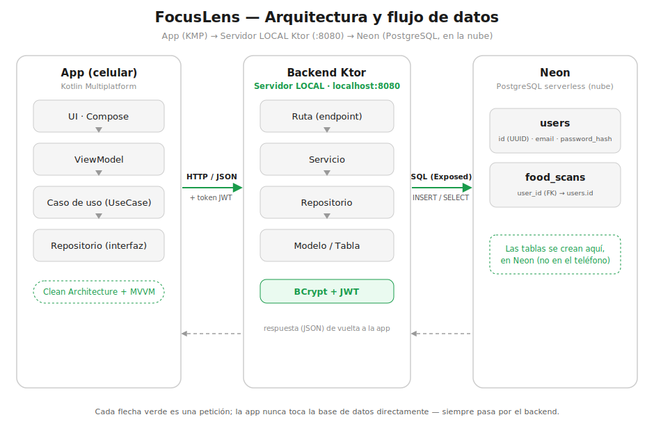

Entrega 2 Proyecto · Alumno: Alvaro Uribe

# 🥗 FocusLens (Aplicaciones en Kotlin)

Aplicación multiplataforma (Android & iOS) para escanear alimentos y obtener información nutricional detallada con análisis personalizado según las metas del usuario, respaldada por un **backend propio (Ktor + PostgreSQL/Neon)** con autenticación **JWT**.

---

## ¿Qué es FocusLens?

FocusLens permite a cualquier persona escanear el código de barras de un alimento y recibir al instante su información nutricional completa, junto con un análisis adaptado al objetivo personal del usuario (perder peso, ganar músculo, alimentación balanceada, etc.).

La idea nació de la necesidad de tomar decisiones alimenticias más informadas de forma rápida y sin tener que buscar manualmente en tablas nutricionales.

---

## 📌 Resumen para la evaluación (TL;DR)

El proyecto tiene **dos partes**: la **app cliente** (KMP) y, desde la Entrega 2, un **backend propio**.
> **Arquitectura en capas en ambas partes** (cada capa con una sola responsabilidad): la **app** usa **Clean Architecture + MVVM** (`Presentation → Domain → Data`), y el **backend** usa la cadena **`Ruta → Servicio → Repositorio → Modelo`**. *Clean Architecture es, justamente, una arquitectura por capas* — no son cosas distintas.
- **¿Qué arquitectura usa la app?** → **Clean Architecture + MVVM**, separada en tres capas (`domain`, `data`, `presentation`) con Koin. Ver [Arquitectura de la app](#-arquitectura-de-la-app).
- **¿Hay backend propio?** → **Sí .** Módulo [`:server`](server/) en **Ktor (Kotlin)** con arquitectura por capas **Modelo → DTO → Repositorio → Servicio → Ruta**. Ver [Backend](#-backend-entrega-2).
- **¿Usa Neon / PostgreSQL?** → **Sí.** El backend persiste en **Neon (PostgreSQL serverless)** mediante **Exposed + HikariCP**. Las tablas (`users`, `food_scans`) se crean automáticamente al arrancar.
- **¿Seguridad?** → **Password hashing con BCrypt** + **JWT** (flujo `TokenRequest` → validación → `TokenResponse`). Rutas protegidas con `Authorization: Bearer <token>`.
- **¿Y los datos nutricionales?** → Se obtienen de la API pública **OpenFoodFacts** (HTTPS, solo lectura, sin API key).

---

## Funcionalidades actuales

### 🔐 Autenticación
- Registro e inicio de sesión con correo y contraseña (validados **localmente** contra SQLDelight)
- Contraseñas almacenadas con hash **SHA-256** (nunca en texto plano)
- Sesión persistente entre reinicios de la app (DataStore)
- Cierre de sesión

### 📷 Escáner de alimentos
- Lectura en tiempo real de códigos de barras (EAN-13, EAN-8, UPC-A, UPC-E)
- Integración nativa por plataforma (CameraX + ML Kit en Android / AVFoundation + Vision en iOS) vía `expect/actual`

### 🍎 Detalle nutricional
- Información completa por 100g: calorías, proteínas, carbohidratos, azúcares, grasas, fibra, sodio
- Barras animadas de progreso nutricional
- Indicador NutriScore (A–E)
- Análisis semáforo personalizado según las metas del usuario

### 📋 Historial
- Registro automático de todos los alimentos escaneados (SQLDelight)
- Eliminar entradas deslizando
- Visualización con fecha y resumen nutricional

### 👤 Perfil
- Nombre y correo del usuario registrado
- Selección de objetivo nutricional
- Configuración de metas diarias (calorías, proteínas, carbohidratos, grasas)
- Guardado con confirmación visual

---

## Stack tecnológico (Kotlin Multiplatform)

La aplicación está construida con **Kotlin Multiplatform (KMP)** y **Compose Multiplatform**, permitiendo compartir ~80% del código entre Android y iOS.

| Categoría | Tecnología |
|-----------|-----------|
| Lenguaje | Kotlin |
| UI | Compose Multiplatform |
| Arquitectura | Clean Architecture + MVVM |
| Inyección de dependencias | Koin |
| Base de datos local | SQLDelight (SQLite) |
| Persistencia de sesión | DataStore KMP |
| Red | Ktor Client |
| API de alimentos | [OpenFoodFacts](https://world.openfoodfacts.org/) |
| Cámara (Android) | CameraX + ML Kit Barcode Scanning |
| Cámara (iOS) | AVFoundation + Vision (Platform `expect/actual`) |

### Backend (módulo `:server`)

| Categoría | Tecnología |
|-----------|-----------|
| Framework | Ktor (Netty) |
| Base de datos | PostgreSQL serverless — **Neon** |
| Acceso a datos | Exposed + HikariCP |
| Seguridad | BCrypt (hashing) + JWT (auth0 java-jwt, HMAC-256) |
| Serialización | kotlinx.serialization |
| Configuración | dotenv-kotlin (`.env`) |

---

## 🏛 Arquitectura de la app

La app cliente sigue **Clean Architecture + MVVM**, con dependencias que apuntan siempre **hacia el dominio** (la capa más interna no conoce a las externas). Esto mantiene el flujo predecible incluso si en el futuro crece a decenas de tablas, DTOs y servicios.

```
┌──────────────────────────────────────────────────────────────┐
│  PRESENTATION  (Compose UI + ViewModels)                       │
│  feature/{auth, scanner, fooddetail, history, profile}         │
│  - Pantallas Compose + UiState + ViewModel (StateFlow)         │
└───────────────────────────┬──────────────────────────────────┘
                            │ llama a Use Cases
┌───────────────────────────▼──────────────────────────────────┐
│  DOMAIN  (lógica de negocio pura, sin dependencias de framework)│
│  - model/        Entidades de negocio (Food, User, FoodScan…)  │
│  - repository/   Interfaces (contratos)                        │
│  - usecase/      Casos de uso (1 acción de negocio c/u)        │
└───────────────────────────▲──────────────────────────────────┘
                            │ implementa las interfaces
┌───────────────────────────┴──────────────────────────────────┐
│  DATA  (acceso a datos)                                        │
│  - remote/api      Cliente Ktor (OpenFoodFacts)                │
│  - remote/dto      DTOs de la API (modelo de transporte)       │
│  - remote/mapper   Mapeadores DTO → modelo de dominio          │
│  - repository/     Implementaciones de los repositorios        │
│  - local/          SQLDelight (DB) + DataStore (sesión)        │
└────────────────────────────────────────────────────────────────┘
```

### Flujo de una operación (ejemplo: escanear un producto)

```
ScannerScreen (Compose)
   → ScannerViewModel              (presentation)
      → GetFoodByBarcodeUseCase    (domain · caso de uso)
         → FoodRepository          (domain · interfaz)
            → FoodRepositoryImpl    (data · implementación)
               → OpenFoodFactsApi  (data · Ktor → HTTPS)
               → FoodDtoMapper      (data · DTO → modelo de dominio)
   ← StateFlow<UiState> actualiza la UI
```

Cada elemento del flujo (DTO, mapper, repositorio, caso de uso) tiene **una sola responsabilidad** y está aislado por capas, por lo que agregar una nueva entidad implica replicar el mismo patrón sin tocar el resto del código.

---

## 🖥 Backend (Entrega 2)

Módulo [`:server`](server/) — una **API REST en Ktor (Kotlin/JVM)** que persiste en **Neon (PostgreSQL serverless)**. Implementa la cadena por capas que se pidió en clase: **Modelo → DTO → Repositorio → Servicio → Ruta**, con seguridad **BCrypt + JWT**.



### Flujo de la arquitectura del backend

```
        Cliente (app KMP)  ──HTTP/JSON──►  RUTA (Ktor Routing)
                                              │  recibe DTO de entrada
                                              ▼
                                          SERVICIO  (lógica de negocio + validación)
                                              │
                                              ▼
                                          REPOSITORIO  (Exposed / SQL)
                                              │
                                              ▼
                                          MODELO / TABLA  ──►  Neon (PostgreSQL)
                                              │
                                              ▼  fila → DTO de salida (Response)
        Cliente (app KMP)  ◄──HTTP/JSON──  RUTA responde
```

### Capas y archivos

| Capa | Carpeta | Responsabilidad |
|------|---------|-----------------|
| **Modelos / Tablas** | [`models/`](server/src/main/kotlin/com/focuslens/server/models) | Definición de tablas Exposed (`users`, `food_scans`) |
| **DTOs** | [`dto/`](server/src/main/kotlin/com/focuslens/server/dto) | Objetos de entrada/salida (incl. `TokenRequest`, `TokenResponse`) |
| **Repositorios** | [`repository/`](server/src/main/kotlin/com/focuslens/server/repository) | Acceso a datos (única capa que toca SQL) |
| **Servicios** | [`service/`](server/src/main/kotlin/com/focuslens/server/service) | Lógica de negocio, validaciones, orquestación |
| **Rutas** | [`routes/`](server/src/main/kotlin/com/focuslens/server/routes) | Endpoints HTTP y mapeo de status codes |
| **Seguridad** | [`security/`](server/src/main/kotlin/com/focuslens/server/security) | `PasswordHasher` (BCrypt) y `JwtService` (HMAC-256) |
| **Infraestructura** | [`db/`](server/src/main/kotlin/com/focuslens/server/db), [`config/`](server/src/main/kotlin/com/focuslens/server/config), [`plugins/`](server/src/main/kotlin/com/focuslens/server/plugins) | Conexión a Neon, configuración (`.env`), plugins Ktor |

### Seguridad (Password Hashing + JWT)

```
Registro/Login (credenciales)
   └─ TokenRequest(email, password)
        └─ AuthService
             ├─ PasswordHasher.hash / verify   (BCrypt, salt automático)
             └─ JwtService.generateToken        (firma HMAC-256)
                  └─ TokenResponse(accessToken, tokenType="Bearer", expiresAt, user)

Petición protegida
   └─ Header: Authorization: Bearer <accessToken>
        └─ Plugin JWT valida firma/issuer/audiencia/expiración
             └─ userId (claim) disponible en la ruta
```

- Las contraseñas se guardan **solo como hash BCrypt** (nunca en texto plano).
- El `passwordHash` **nunca** se serializa hacia el cliente (los DTOs `*Response` no lo incluyen).
- El historial está acotado por `userId`: un usuario solo accede a sus propios escaneos.

### Endpoints

| Método | Ruta | Auth | Cuerpo (entrada) | Respuesta |
|--------|------|:----:|------------------|-----------|
| `GET`  | `/health` | — | — | `{ "status": "ok" }` |
| `POST` | `/api/v1/auth/register` | — | `RegisterRequest` | `TokenResponse` |
| `POST` | `/api/v1/auth/login` | — | `TokenRequest` | `TokenResponse` |
| `GET`  | `/api/v1/users/me` | 🔒 JWT | — | `UserResponse` |
| `PUT`  | `/api/v1/users/me/goals` | 🔒 JWT | `UpdateGoalsRequest` | `UserResponse` |
| `GET`  | `/api/v1/scans` | 🔒 JWT | — | `List<ScanResponse>` |
| `POST` | `/api/v1/scans` | 🔒 JWT | `CreateScanRequest` | `ScanResponse` |
| `DELETE` | `/api/v1/scans/{id}` | 🔒 JWT | — | `204 No Content` |
| `PATCH` | `/api/v1/scans/{id}/notes` | 🔒 JWT | `UpdateNotesRequest` | `204 No Content` |

### Tablas en Neon

| Tabla | Descripción |
|-------|-------------|
| `users` | Usuarios: nombre, email (único), `password_hash`, metas nutricionales |
| `food_scans` | Historial de escaneos por usuario (FK `user_id` → `users.id`, `ON DELETE CASCADE`) |

Se crean automáticamente en el primer arranque vía `SchemaUtils.create` ([`DatabaseFactory.kt`](server/src/main/kotlin/com/focuslens/server/db/DatabaseFactory.kt)).

### ▶️ Cómo ejecutar el backend

1. Copia `server/.env.example` a `server/.env` y pega tu connection string de Neon y un `JWT_SECRET`:
   ```env
   DATABASE_URL=jdbc:postgresql://<host>.neon.tech/<db>?sslmode=require
   DATABASE_USER=<usuario>
   DATABASE_PASSWORD=<password>
   JWT_SECRET=<cadena-larga-aleatoria>
   ```
2. Levanta el servidor:
   ```bash
   ./gradlew :server:run
   ```
3. Verifica que está vivo: `GET http://localhost:8080/health` → `{ "status": "ok" }`.

> El `.env` está en `.gitignore`: las credenciales **nunca** se suben al repositorio.

### Integración con la app cliente

La app KMP **ya consume este backend** para autenticación, perfil e historial. Gracias a que el dominio depende solo de **interfaces** (`AuthRepository`, `UserProfileRepository`, `ScanHistoryRepository`), solo se añadió una nueva implementación en la capa `data` **sin tocar dominio ni UI**:

| Componente cliente | Rol |
|--------------------|-----|
| [`FocusLensApi`](shared/src/commonMain/kotlin/com/focuslens/data/remote/api/FocusLensApi.kt) | Cliente Ktor del backend; adjunta el JWT en cada petición |
| [`RemoteAuthRepository`](shared/src/commonMain/kotlin/com/focuslens/data/repository/RemoteAuthRepository.kt) | Implementa `AuthRepository` + `UserProfileRepository` contra la API |
| [`RemoteScanHistoryRepository`](shared/src/commonMain/kotlin/com/focuslens/data/repository/RemoteScanHistoryRepository.kt) | Historial como `Flow` reactivo, refrescado desde la API |
| `SessionManager` | Guarda el token JWT en DataStore |
| `serverBaseUrl()` (expect/actual) | URL base por plataforma: Android `10.0.2.2:8080`, iOS `localhost:8080` |

El **escáner** sigue consultando OpenFoodFacts directamente (datos nutricionales); el **backend** guarda usuarios e historial. Para probar la app contra el backend, primero levanta el servidor (`./gradlew :server:run`) y luego corre la app desde Android Studio.

---

## 💾 Dónde vive cada dato

| Qué se guarda | Dónde | Tecnología |
|---------------|-------|------------|
| Usuarios (credenciales + metas) | **Backend / Neon** | PostgreSQL vía la API |
| Historial de escaneos | **Backend / Neon** | PostgreSQL vía la API |
| Token JWT de la sesión | En el dispositivo | **DataStore** (key-value) |
| Datos nutricionales de productos | Se consultan en línea | **OpenFoodFacts** (API pública) |

> Los `*RepositoryImpl` locales con **SQLDelight** se conservan en el código como alternativa local-first, pero el cableado de DI actual usa las implementaciones **remotas** (backend).

---

## 📂 Estructura del proyecto

El código está dividido en módulos. La **app cliente** (`app`, `shared`, `iosApp`) y el **backend** (`server`):

```
FocusLens-main/
├── server/                          # 🖥 Backend Ktor (Entrega 2)
│   ├── src/main/kotlin/com/focuslens/server/
│   │   ├── models/                  # Tablas Exposed (users, food_scans)
│   │   ├── dto/                     # DTOs (TokenRequest/Response, ...)
│   │   ├── repository/              # Acceso a datos (Exposed/SQL)
│   │   ├── service/                 # Lógica de negocio
│   │   ├── routes/                  # Endpoints HTTP
│   │   ├── security/                # BCrypt + JWT
│   │   ├── db/ · config/ · plugins/ # Neon, .env, plugins Ktor
│   │   └── Application.kt           # Punto de entrada
│   └── .env.example                 # Plantilla de credenciales (Neon, JWT)
├── shared/                          # Código compartido (KMP)
│   └── src/
│       ├── commonMain/              # Lógica común (dominio, data, UI Compose, DI)
│       │   ├── kotlin/com/focuslens/
│       │   │   ├── domain/          # model · repository (interfaces) · usecase
│       │   │   ├── data/            # remote (api/dto/mapper) · repository · local
│       │   │   ├── presentation/    # feature/* (screens + viewmodels) · navigation · theme
│       │   │   ├── di/              # Módulos Koin
│       │   │   └── platform/        # Declaraciones expect (multiplataforma)
│       │   └── sqldelight/          # Esquema y queries (.sq)
│       ├── androidMain/             # Implementaciones nativas Android (CameraX, drivers)
│       └── iosMain/                 # Implementaciones nativas iOS (AVFoundation, drivers)
├── app/                             # Aplicación Android (App Host)
│   └── src/main/                    # MainActivity y FocusLensApplication
└── iosApp/                          # Aplicación iOS (App Host)
    └── iosApp/                      # iOSApp.swift y configuración de Xcode
```

---

## API utilizada

**OpenFoodFacts** — Base de datos abierta y colaborativa de más de 3 millones de productos alimenticios de todo el mundo.

- Endpoint: `https://world.openfoodfacts.org/api/v2/product/{barcode}`
- Gratuita, **sin necesidad de API key**
- Datos verificados por la comunidad
- Se solicitan solo los campos necesarios (`fields=...`) para reducir el tamaño de la respuesta

---

## ▶️ Cómo ejecutar

**Android**
```bash
./gradlew :app:installDebug
```
o abrir el proyecto en Android Studio y ejecutar la configuración `app`.

**iOS**
Abrir `iosApp/iosApp.xcodeproj` en Xcode y ejecutar sobre un dispositivo/simulador (la cámara requiere dispositivo físico).

> No requiere configurar variables de entorno, base de datos ni servidor: la app funciona de forma autónoma.

---

## Equipo

Proyecto universitario desarrollado como parte del curso de Desarrollo de Aplicaciones Móviles.

---

## Licencia

Uso académico — Universidad de Los Lagos
